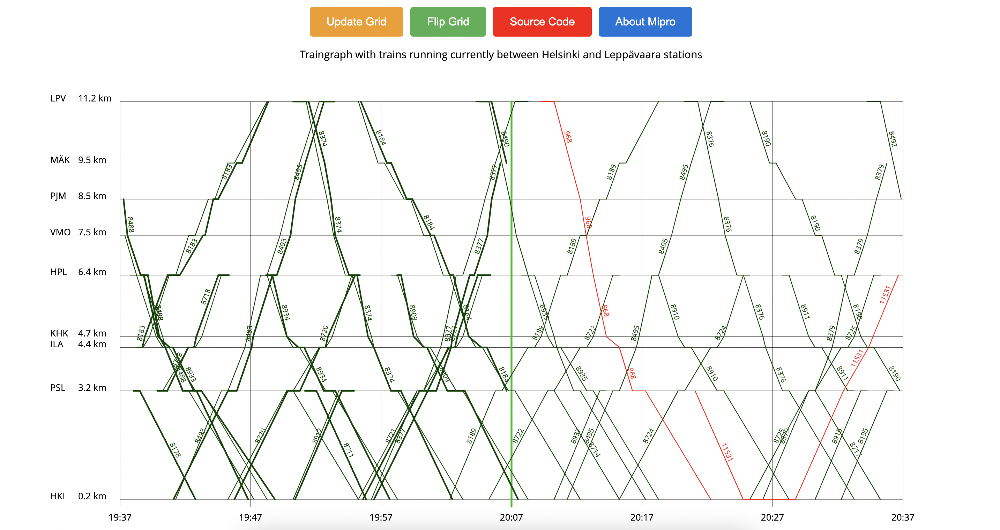

# Mipro Traingraph

Access it [here!](https://mipro-traingraph-kuk2uka4xa-lz.a.run.app/trains)

Mipro Traingraph is a Java Spring Boot application that provides a graphical representation of trains running between Helsinki and Leppävaara stations. It fetches live data from the rata.digitraffic.fi API to display train schedules and travel times on a graph. Project is deployed with CI CD to Google cloud platform.

## Features

- Displays the train graph with current train schedules and travel times between Helsinki and Leppävaara stations.
- Allows switching between distance and time axes on the graph.
- Highlights train lines when hovered over.
- Fetches live data from the rata.digitraffic.fi API.

## Prerequisites

Before running the application, make sure you have the following prerequisites installed:

- Java Development Kit (JDK) 11 or higher
- Apache Maven
- Docker

## Installation (with docker)
1. Build the jar file with maven
   ```shell
   mvn clean package
   ```
2. Build and compose:
   ```shell
   docker build -t mipro-traingraph .
   docker-compose up
   ```
3. Access the application in your web browser
   ```shell
   http://localhost:8080
   ```

## Installation (without docker)

1. Clone the repository:

   ```shell
   git clone https://github.com/realr3fo/mipro-traingraph.git
    ```

2. Navigate to the project directory:
   ```shell
   cd mipro-traingraph
   ```
3. Build the application usign Maven:
   ```shell
   mvn clean install
   ```
4. Run the application using Maven:
   ```shell
   mvn spring-boot:run
   ```
5. Access the application in your web browser
   ```shell
   http://localhost:8080
   ```


## Technologies Used
- Java
- Javascript
- Spring Boot
- Thymeleaf
- Maven
- HTML/CSS


## Snippet
